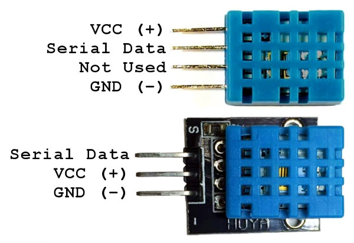
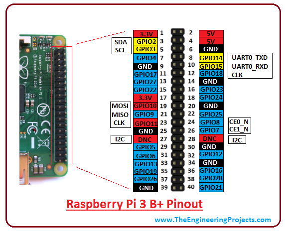

# 1. AulesSocarrades

Monitoratge de temperatura i humetat a les aules mitjançant un sensor DHT11 i una Raspberry Pi 3. Les dades s'envien a [aulessocarrad.es](https://www.aulessocarrad.es/).

## 1.1. Requisits

- Raspberry Pi 3 (amb Raspberry Pi OS)
- Sensor DHT11 (mòdul de 3 pins)
- Connexió a Internet (Wi‑Fi o Ethernet)

## 1.2. Connexionat del sensor DHT11

| Sensor DHT11 | Raspberry Pi 3 (GPIO) |
|--------------|----------------------|
| VCC          | Pin físic 2 (5V)     |
| GND          | Pin físic 6 (GND)    |
| DATA         | Pin físic 7 (GPIO 4) |





## 1.3. Instal·lació i posada en marxa

### 1.3.1. Clonar el repositori

Descomprimir la carpeta al disc dur, per exemple al home de l'usuari admin:

```bash
git clone https://github.com/IesElJust/aulessocarrades.git
cd ./aulessocarrades
```

### 1.3.2. Crear l'entorn virtual

```bash
python3 -m venv venv
```

### 1.3.3. Activar l'entorn virtual i instal·lar dependències

```bash
source venv/bin/activate
pip install -r requirements.txt
```

### 1.3.4. Configurar el token del dispositiu

Edita `dht11_send.py` i canvia `DEVICE_TOKEN` pel token obtingut en registrar el dispositiu a [https://www.aulessocarrad.es/admin/devices](https://www.aulessocarrad.es/admin/devices)

```python
DEVICE_TOKEN = "token_de_dispositiu"  # ← Canvia açò
```

### 1.3.5. IMPORTANT: Ajustar els PATHs als scripts

Assegura't que els scripts tinguen els PATHs correctes:

- **`dht11_send.py`**: la shebang (primera línia) ha d'apuntar al Python de l'entorn virtual:
  ```python
  #!/home/admin/aulessocarrades/venv/bin/python3
  ```
- **`dht11_iniciar.sh`** i **`crontab`**: els PATHs als fitxers han de coincidir amb la ubicació real al sistema.

### 1.3.6. Donar permisos d'execució

```bash
chmod +x dht11_send.py dht11_iniciar.sh
```

### 1.3.7. Comprovar que tot funciona

Abans de començar a enviar a [aulessocarrad.es](https://www.aulessocarrad.es), pots comprovar que el sensor funciona correctament utilitzant:

```bash
python3 dht11_test.py           # Test de lectura del sensor
```

Una vegada comprovat, ja pots enviar la informació a [aulessocarrad.es](https://www.aulessocarrad.es). Recorda posar el token a la variable corresponent:

```bash
python3 dht11_send.py           # Enviament a l'API
```

Si tot funciona, ja pots continuar amb l'execució automàtica a través de crontab.

### 1.3.8. Configurar el crontab

Edita el crontab de l'usuari:

```bash
crontab -e
```

I afegeix les següents línies (recorda ajustar els PATH `/home/admin` per el corresponent):

```cron
@reboot sleep 15 && : > /home/admin/aulessocarrades/dht11_send.log && /home/admin/aulessocarrades/venv/bin/python3 /home/admin/aulessocarrades/dht11_send.py >> /home/admin/aulessocarrades/dht11_send.log 2>&1
* * * * * /home/admin/aulessocarrades/dht11_iniciar.sh
```

El que estem fent bàsicament és:

- `@reboot ...`: quan la Raspberry Pi arranca, espera 15 segons, buida el fitxer de log dht11_send.log, i després executa el script Python dht11_send.py dins del venv, guardant tant la sortida normal com els errors al log.

- `* * * * * /home/admin/aulessocarrades/dht11_iniciar.sh`: verifica cada minut que `dht11_send.py` s'estiga executant i l'inicia en cas de no estar executant-se.

**Nota sobre els PATHs**: el cron executa amb un entorn mínim. És important:

- Usar PATHs absoluts a l'script `dht_iniciar.sh`.
- Comprovar que el shebang de l'script `dht11_send.py` apunte a l'executable python3 de l'entorn virtual.

### 1.3.9. Logs

Si inicies a través de crontab o del script `dht11_iniciar.sh`, podràs veure els logs a `dht11_send.log`.

## 1.4. Estructura del projecte

```
├── README.md
├── requirements.txt         # Dependències Python
├── dht11_test.py            # Script de prova del sensor
├── dht11_send.py            # Script d'enviament de dades a l'API
├── dht11_iniciar.sh         # Script de reinici (crontab)
├── crontab                  # Configuració de cron de referència
└── dht11_send.log           # Fitxer de log
```
